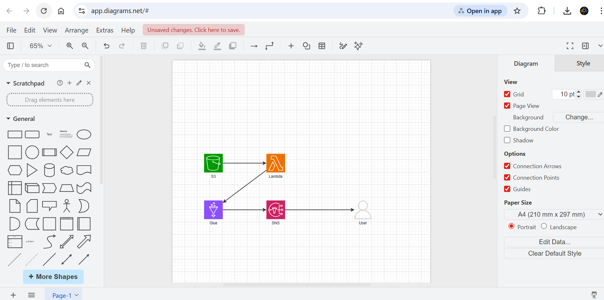
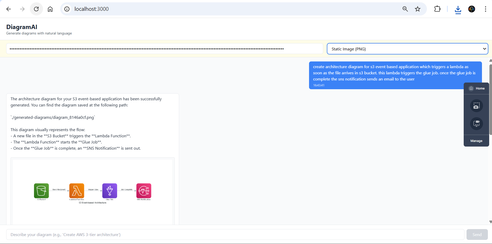

# DiagramAI

DiagramAI is an AI-powered architecture diagram generator that turns natural language into professional cloud architecture diagrams. 

It leverages **Python Strands Agents** and the **Model Context Protocol (MCP)** to intelligently map your requests to actual diagramming tools, supporting both interactive **Draw.io** canvases and static **AWS Architecture PNG** generation.

## 🚀 Features

- **Natural Language to Diagram**: Simply ask for what you need (e.g., "Create a 3-tier AWS application with an ELB, two EC2s, and RDS").
- **Dual Output Modes**:
  - **Interactive (Draw.io)**: Connects to your browser's Draw.io tab to dynamically paint the architecture live using the official AWS mxgraph style library.
  - **Static Image (PNG)**: Compiles Python `diagrams` graph code securely and returns a beautiful PNG that renders directly in your chat UI.
- **Agentic Resilience**: Utilizes the Strands Agent framework to automatically retry, validate, and sequence tool calls.

## 🎥 Demo

Watch DiagramAI in action!

[▶️ **Click here to watch the full Demo Video**](https://github.com/manish6007/diagram-ai/raw/main/assets/demo.mp4)

### Interactive Draw.io Mode



### Static PNG Mode


## 🏗️ Architecture Stack

DiagramAI is composed of three services working together:

1. **Frontend (React/Vite)**
   - Port `3000`
   - A clean UI for entering Prompts, API Keys, and selecting diagram output formats.
2. **Backend Proxy (Express/TypeScript)**
   - Port `4000`
   - Handles API routing, SQLite session management, and static file serving for generated PNG diagrams.
3. **Agent Bridge (Python)**
   - Port `8765`
   - The brain. Manages the connection between the OpenAI LLM, the `awslabs.aws-diagram-mcp-server`, and the `drawio` MCP browser extension.

## 🛠️ Setup & Installation

### Requirements
- Node.js 20+
- Python 3.10+
- OpenAI API Key

### 1. Install Dependencies

```bash
# Frontend
cd frontend && npm install

# Backend
cd backend && npm install

# Python Bridge
cd mcp-bridge
pip install -r requirements.txt
pip install awslabs.aws-diagram-mcp-server
```

### 2. Draw.io Extension (Required for Interactive Mode)
To let the AI draw in your browser dynamically:
1. Open [app.diagrams.net](https://app.diagrams.net/) in Chrome/Edge.
2. Install the **[Draw.io MCP Browser Extension](https://github.com/lgazo/drawio-mcp-extension)**.
3. Keep the default port `3333`.

### 3. Launching

You can start the entire stack instantly using the provided windows script:

```bash
.\up.bat
```

This script will spin up three consoles for the frontend, backend, and python agent bridge. 

## 💡 Usage

1. Open `http://localhost:3000`.
2. Enter your **OpenAI API Key**.
3. Select your desired output mode: **Interactive Diagram (Draw.io)** or **Static Image (PNG)**.
4. Input your architecture request in natural language.
5. If using Draw.io, tab over to `app.diagrams.net` and watch the AI draw! If using PNG, wait for the image to generate and appear directly in the chat!
